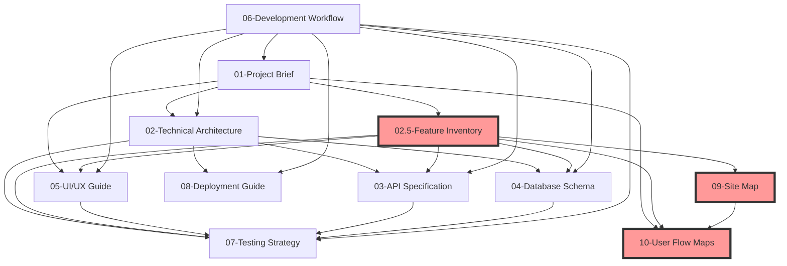

# Documentation Organization System - ENHANCED

## Overview
This document establishes the organizational framework for all project documentation, following **Minimum Viable Documentation (MVD)** principles to maintain lean, valuable, and maintainable documentation. **ENHANCED** with comprehensive feature and interaction documentation.

## Complete Document Structure

### Master Document Index
All documents follow this hierarchical structure:
```
docs/
├── 00-doc-organization-system.md        [THIS FILE - Master Guide]
├── 01-project-brief-requirements.md     [Project Foundation]
├── 02-technical-architecture-design.md  [System Blueprint]
├── 02.5-feature-inventory-component-matrix.md [COMPREHENSIVE FEATURE CATALOG]
├── 03-api-specification.md              [Interface Definitions]
├── 04-database-schema-models.md         [Data Architecture]
├── 05-uiux-component-guide.md           [Design System]
├── 06-development-workflow-standards.md [Team Processes]
├── 07-testing-quality-strategy.md       [Quality Assurance]
├── 08-deployment-operations-guide.md    [Operations & Maintenance]
├── 09-site-map-information-architecture.md [Navigation & Structure]
└── 10-user-flow-journey-maps.md         [User Experience Flows]
```

## Enhanced Document Dependencies Map
Understanding how documents relate to each other in the comprehensive system:


**Legend:**
-   **Red boxes** = New comprehensive documents added
-   **Blue boxes** = Core technical documents
-   **Green boxes** = Process and operational documents

## Enhanced Naming Conventions

### File Naming Format
`[NN]-[document-type]-[specific-name].md`

**Updated Rules:**
-   Use two-digit prefixes with decimal extensions for related docs (02, 02.5, 03)
-   Enhanced documents use descriptive suffixes
-   Keep filenames under 50 characters
-   Use descriptive, searchable names

## Cross-Reference Format Enhanced
When referencing other documents:
-   Link to entire document: `[Document Name](./filename.md)`
-   Link to specific section: `[Section Name](./filename.md#section-anchor)`
-   Link to specific features: `[Feature Detail](./02.5-feature-inventory-component-matrix.md#feature-name)`
-   Link to specific user flows: `[User Journey](./10-user-flow-journey-maps.md#journey-name)`
-   With context: `[Related Info](./filename.md#section-anchor "Tooltip context")`

## Content Standards Enhanced

### Section Structure
Every document follows this enhanced pattern:
```markdown
# Document Title

> **AI ANALYSIS PROMPT FOR GEMINI:**
> [Specific, detailed prompt for AI analysis of the codebase]

## Document Info
- **Version:** vX.X
- **Last Updated:** YYYY-MM-DD
- **Document Owner:** [Name/Role]
- **Review Cycle:** [Frequency based on document type]

## Quick Reference
- Key metrics and summary information
- Links to most important sections

## [Main Content Sections - Detailed and Specific]
...

## Related Documents
- [Links to dependent/related docs with specific context]

## Changelog
- Version history and major changes
```

### AI Prompt Standards
Each document now includes a comprehensive AI analysis prompt that will:
-   Analyze actual codebase rather than generate generic content
-   Be specific to document purpose (features vs architecture vs flows)
-   Request detailed examination of relevant code patterns
-   Ask for clarification when analysis is insufficient
-   Generate realistic examples based on actual implementation

## Enhanced Cross-Reference Management

### Linking Strategy Enhanced
1.  **Contextual Links:** Embed links naturally within content where readers need them
2.  **Feature Cross-References:** Link features to their technical implementation, user flows, and testing
3.  **Component Cross-References:** Link UI components to their usage in features and user journeys
4.  **Flow Cross-References:** Link user flows to their technical requirements and feature implementations
5.  **Bidirectional Links:** Comprehensive cross-referencing between all related documents

### Enhanced Link Maintenance
-   Use relative paths for internal documents (`./filename.md`)
-   Include descriptive link text with context about what you'll find
-   Validate links during document reviews
-   Update cross-references when documents are restructured
-   **NEW:** Validate feature references across documents to ensure consistency

### Enhanced Anchor Strategy
Use consistent anchor formats across all documents:
-   For specific features: `#feature-[feature-name]`
-   For UI/UX components: `#component-[component-name]`
-   For user workflows: `#workflow-[workflow-name]`
-   For API endpoints: `#api-[endpoint-name]`
-   For user journeys: `#journey-[journey-name]`
-   For component or application states: `#state-[state-name]`

## Document Lifecycle Enhanced

### Creation Process
1.  Copy appropriate template from this system
2.  Use the **AI prompt** with your actual codebase to generate realistic content
3.  Fill out all required sections with analysis results
4.  Add cross-references to related documents including the **new comprehensive docs**
5.  Review for MVD compliance and accuracy against actual code
6.  **Validate feature/component consistency** across related documents

### Enhanced Maintenance Schedule
-   **Real-time:** Update when systems change (especially Feature Inventory and User Flows)
-   **Weekly:** Review Feature Inventory and Site Map during active development
-   **Monthly:** Full document review, cross-reference validation, and user journey updates
-   **Quarterly:** Complete system review and optimization
-   **As-needed:** Update based on user feedback, new features, or architectural changes

## Document-Specific Usage Guidelines

### 02.5-Feature Inventory & Component Matrix
-   **Purpose:** Exhaustive catalog of every feature, component, interaction, and state
-   **Usage:**
    -   Reference this FIRST when analyzing any feature or component
    -   Update this immediately when adding new features
    -   Use as source of truth for component states and interactions
    -   Cross-reference with User Flows for complete picture

### 09-Site Map & Information Architecture
-   **Purpose:** Complete navigation and content organization
-   **Usage:**
    -   Reference for all routing and navigation decisions
    -   Update when adding new pages or changing navigation
    -   Use with User Flows to understand navigation patterns
    -   Essential for understanding information hierarchy

### 10-User Flow & Journey Maps
-   **Purpose:** Comprehensive user experience documentation
-   **Usage:**
    -   Reference for all UX decisions and feature prioritization
    -   Update when user workflows change
    -   Use with Feature Inventory to understand feature usage context
    -   Critical for identifying optimization opportunities

## Quality Checklist Enhanced
Before finalizing any document, verify:
-   [ ] Follows established naming conventions
-   [ ] Includes required "Document Info" section
-   [ ] Has clear purpose and scope statement
-   [ ] Uses **AI analysis prompt results** rather than generic content
-   [ ] Contains only essential information (MVD principle)
-   [ ] Uses consistent formatting and style
-   [ ] Includes **cross-references to new comprehensive documents**
-   [ ] **Feature/component references are consistent** across all documents
-   [ ] **User flows align with technical implementation**
-   [ ] Links are valid and descriptive
-   [ ] Content is current and matches actual codebase

## Tool Integration Enhanced

### IDE Compatibility
-   All documents use standard Markdown for maximum IDE support
-   Include YAML frontmatter where needed for metadata
-   Use standard Markdown extensions (tables, code blocks, mermaid diagrams)
-   **Enhanced:** Mermaid diagrams for complex relationships and flows

## AI Analysis Integration
-   Documents include structured AI prompts for automated analysis
-   Consistent prompt format enables systematic codebase analysis
-   **Template-based approach** supports comprehensive documentation generation
-   **Validation prompts** can verify document accuracy against codebase

## Cross-Document Validation
-   **Feature consistency checking** across multiple documents
-   **Component reference validation** between technical and UX docs
-   **User flow alignment** with technical capabilities
-   **API endpoint consistency** between specification and feature usage

## System Usage Workflow

### For New Projects
1.  Start with **Organization Guide** (this document)
2.  Use **Project Brief** template with AI prompt
3.  Complete **Feature Inventory** comprehensively with AI analysis
4.  Build **Site Map** showing complete navigation structure
5.  Document **User Flows** for all major scenarios
6.  Complete remaining documents in dependency order
7.  Validate cross-references and consistency

### For Existing Projects
1.  Analyze current state with **Feature Inventory** AI prompt
2.  Map existing navigation with **Site Map** template
3.  Document current **user flows** comprehensively
4.  Fill gaps in technical documentation
5.  Establish cross-references between all documents
6.  Validate consistency across the complete system

### For Ongoing Maintenance
1.  Update **Feature Inventory** immediately when features change
2.  Update **User Flows** when user experience changes
3.  Update **Site Map** when navigation changes
4.  Propagate changes through cross-referenced documents
5.  Validate consistency monthly across all documents

## Document Completeness Validation

### The "Button → Popup → Onboarding" Test
Using the example you provided, here's how our enhanced system captures this complexity:

1.  **Feature Inventory** documents:
    -   Button component and all its states
    -   Popup/modal component and its lifecycle
    -   Onboarding workflow as a complete feature
    -   Interaction chain from `button` → `popup` → `workflow`
    -   State changes throughout the process
2.  **Site Map** documents:
    -   Where the button appears in the navigation structure
    -   How the onboarding flow fits into the overall site architecture
    -   Entry and exit points for the onboarding process
3.  **User Flows** document:
    -   Complete user journey including emotional states
    -   Alternative paths and error recovery
    -   Drop-off points and optimization opportunities
4.  **UI/UX Guide** documents:
    -   Button design specifications and variations
    -   Modal design system and behavior
    -   Onboarding UI patterns and components
5.  **Technical Architecture** documents:
    -   Component relationships and data flow
    -   State management for the interaction chain
    -   API calls triggered by the workflow

**Result:** Every aspect of the "button → popup → onboarding" interaction is documented across multiple documents with cross-references, ensuring nothing is missed and everything is connected.

---

**Document Info**
-   **Version:** v2.0 - Enhanced with comprehensive feature documentation
-   **Last Updated:** 2025-10-09
-   **Document Owner:** Documentation System
-   **Review Cycle:** As-needed with monthly validation

**Related Documents** - All documents in this system reference and build upon this organizational guide.
-   **Primary Dependencies:** Feature Inventory, Site Map, User Flows (the new comprehensive documents)
