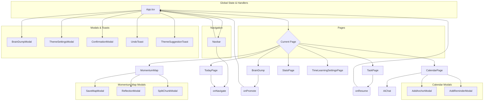

# Feature Inventory & Component Matrix

> **AI ANALYSIS PROMPT FOR GEMINI:**
> "I have a working web app prototype and need you to create an exhaustive Feature Inventory & Component Matrix. This is critical for understanding every aspect of the application. Please:
> 1. Catalog every single feature - Major features, sub-features, micro-features, and edge case behaviors
> 2. Map all components and their relationships - Every React component, how they connect, parent-child relationships
> 3. Document component states - Default, loading, error, success, disabled, active, hover, focus states for EVERY component
> 4. Trace interaction chains - When user clicks X, what happens? What components get triggered? What state changes occur?
> 5. Document conditional logic - If user is logged in vs logged out, admin vs regular user, etc.
> 6. Map data flow through components - How props flow down, how events bubble up, how state is managed
> 7. Identify all user workflows - Complete user journeys from start to finish, including error paths and edge cases
> 8. Document form behaviors - Every form, every field, validation states, submission flows, error handling
> 9. Catalog modal/popup/overlay behaviors - What triggers them, what they contain, how they close, what happens after
> 10. Map navigation patterns - How users move between sections, breadcrumbs, back buttons, deep linking
>
> Be exhaustive. This document should be a complete inventory where NOTHING is missed. If you see a button, document what it does, what it triggers, what states it can be in. If there's a form, document every field, every validation rule, every possible outcome."

---

## Document Info
-   **Version:** v1.0
-   **Last Updated:** 2024-10-26
-   **Document Owner:** Project Lead
-   **Review Cycle:** Weekly during development, monthly during maintenance

---

## Quick Reference
-   **Total Features:** 7 Major Feature Categories
-   **Total Components:** 29 primary components and ~40 icon/utility components
-   **Total Pages/Views:** 8 distinct pages managed by application state
-   **Total User Workflows:** 3 primary user workflows documented
-   **Critical Interaction Chains:** 5 key AI-driven interaction chains

---

## Feature Hierarchy & Inventory

### 1. Feature: AI-Powered Brain Dump
-   **Purpose:** To provide a low-friction method for users to capture unstructured thoughts, which are then automatically organized by the Gemini API.
-   **Components Involved:** `BrainDumpModal`, `BrainDump` (page), `TrashIcon`, `NoteIcon`.
-   **Entry Points:**
    -   Clicking the "Brain Dump" button in the `Navbar`.
    -   Using the `Ctrl+B` keyboard shortcut to open the `BrainDumpModal`.
    -   Navigating directly to the "Brain Dump" page.
-   **Exit Points:**
    -   Closing the modal.
    -   Navigating to another page.
    -   Promoting selected items to a Momentum Map.

#### Sub-Features:
-   **Quick Capture:**
    -   **Workflow:** User opens `BrainDumpModal`, types thoughts, and submits.
    -   **Components:** `BrainDumpModal`, `App`.
    -   **Data Flow:** `inputText` (local state) -> `onSubmit` prop -> `handleBrainDumpSubmit` in `App.tsx` -> Gemini API call -> `setProcessedItems` global state update.
-   **Thought Organization & Clustering:**
    -   **Workflow:** On the `BrainDump` page, the user can click "Cluster" to have the AI group related items.
    -   **Components:** `BrainDump` (page).
    -   **Triggers:** User clicks "Cluster" button.
    -   **Outcomes:** AI refines items, suggests clusters, and displays them in a "Suggestion Tray" or as cards.
-   **Item Management:**
    -   **Workflow:** Users can select, delete, add tags, and add private notes to individual items.
    -   **Components:** `BrainDump` (page).
    -   **States:** Default, Selected, Editing Note.
-   **Promote to Map:**
    -   **Workflow:** User selects one or more items and clicks "Promote to Map." A modal appears to select the primary goal, and the user is navigated to the `MomentumMap` page to generate a plan.
    -   **Components:** `BrainDump` (page), `PromoteModal` (within BrainDump), `MomentumMap` (page).

### 2. Feature: Momentum Map
-   **Purpose:** To turn a single user goal into a complete, step-by-step project plan, facilitating task initiation and progress tracking.
-   **Components Involved:** `MomentumMap` (page), `ReflectionModal`, `SplitChunkModal`, `UnblockerModal`, `SaveMapModal`, `CompletionFeedbackCard`, `Confetti`.
-   **Entry Points:**
    -   Navigating to the "Momentum Map" page from the `Navbar`.
    -   Being redirected after promoting items from the "Brain Dump" page.
    -   Resuming a saved map from the "Task" page.
-   **Exit Points:**
    -   Completing the entire map.
    -   Saving the map to work on later.
    -   Navigating away.

#### Sub-Features:
-   **AI Plan Generation:**
    -   **Workflow:** User enters a high-level goal, and the Gemini API generates a `MomentumMapData` object containing a Finish Line, Chunks, and Sub-steps.
-   **Task Execution & Progress Tracking:**
    -   **Workflow:** User checks off sub-steps. The UI updates to reflect chunk and overall project progress. An active chunk timer is displayed.
-   **Chunk Management:**
    -   **Workflow:** Users can split a large chunk into smaller ones (with AI assistance), get unblocked on a specific step (with AI micro-step suggestions), or add reflections after completing a chunk.
-   **Adaptive Time Estimates:**
    -   **Workflow:** After completing a chunk, the user provides feedback on its difficulty. This data is stored and used by the `timeAnalytics` utility to provide personalized P50/P90 estimates for future chunks.
-   **Map Persistence:**
    -   **Workflow:** User can save the current state of the map with a note, which creates a `SavedTask` item on the "Task" page.

### 3. Feature: Today Dashboard
-   **Purpose:** To provide a single, focused view of the most important item for the user to work on at the current moment, reducing decision fatigue.
-   **Components Involved:** `TodayPage`, `CalendarIcon`, `MomentumMapIcon`, `TaskIcon`, `DropdownMenu`.
-   **Entry Points:** Default page on application load. Navigation via `Navbar`.
-   **Exit Points:** Navigating to any other page.

#### Sub-Features:
-   **"Next Right Thing" Prioritization:**
    -   **Logic:** A `useMemo` hook in `TodayPage` evaluates a set of rules in order: an imminent calendar event, the next step in an active Momentum Map, an urgent brain dump item, or a quick-win task.
-   **Upcoming Timeline:**
    -   **Logic:** Displays the next 3 upcoming calendar anchors and smart reminders for the current day.
-   **Quick Wins Carousel:**
    -   **Logic:** Displays a horizontally scrollable list of non-urgent brain dump items with a time estimate of 25 minutes or less.

### 4. Feature: Calendar & Smart Reminders
-   **Purpose:** To establish a user's weekly routine ("Anchors") and attach context-aware prompts ("Smart Reminders") to facilitate transitions and habit formation.
-   **Components Involved:** `CalendarPage`, `AddAnchorModal`, `AddReminderModal`, `AiChat`, `BellIcon`.
-   **Entry Points:** Navigation via `Navbar`.
-   **Exit Points:** Navigating away.

#### Sub-Features:
-   **Onboarding Wizard:** A one-time setup flow to help users define their initial work/school blocks and Do Not Disturb windows.
-   **Anchor Management:** Users can manually add, edit, or delete recurring weekly time blocks.
-   **Smart Reminder Creation:** Users can create reminders via a structured modal or by using natural language in the AI Chat.
-   **AI Chat Integration:** The `AiChat` component uses the Gemini API to parse natural language commands for creating anchors and reminders.

### 5. Feature: Task & Map Management
-   **Purpose:** To provide a central place to view and manage all saved (paused) Momentum Maps.
-   **Components Involved:** `TaskPage`, `TrashIcon`.
-   **Entry Points:** Navigation via `Navbar`.
-   **Exit Points:** Resuming a map (navigates to `MomentumMap`) or navigating elsewhere.
-   **Sub-Features:** Sorting (by date, name), editing notes/nicknames, deleting, and resuming maps.

### 6. Feature: Stats & Time Learning
-   **Purpose:** To give users non-judgmental insights into their work patterns and manage the data that powers personalized time estimates.
-   **Components Involved:** `StatsPage`, `TimeLearningSettingsPage`, various chart/icon components.
-   **Entry Points:** Navigation via `Navbar` to "Progress" (`StatsPage`) or "Settings" (`TimeLearningSettingsPage`).
-   **Sub-Features:**
    -   **Performance Dashboard:** (`StatsPage`) Displays mock data for streak, velocity, and accuracy. Includes a heatmap of productivity.
    -   **Learning Configuration:** (`TimeLearningSettingsPage`) Allows users to enable/disable personalized estimates and adjust sensitivity.
    -   **Data Management:** Users can export or reset all their completion history data.

### 7. Feature: Dynamic Theming
-   **Purpose:** To adjust the app's sensory experience (colors, animations) to match the user's current context or mental state, reducing overstimulation or providing energy.
-   **Components Involved:** `ThemeSettingsModal`, `ThemeSuggestionToast`, `WandIcon`. The logic is handled by the `useTheme` hook in `App.tsx`.
-   **Entry Points:**
    -   User clicks the theme button in the `Navbar` to open `ThemeSettingsModal`.
    -   System automatically shows a `ThemeSuggestionToast` based on context.
-   **Sub-Features:**
    -   **Auto Mode:** The `determineOptimalTheme` engine selects a theme (Creative, Focus, Recovery, Evening) based on time of day, active tasks, and upcoming events.
    -   **Manual Mode:** User can override the auto-selection and choose a specific theme.
    -   **Customization:** Users can apply presets (e.g., High Contrast, Reduced Motion) or fine-tune individual properties like animation speed and contrast levels.

---

## Component Interaction Matrix

### Component Relationship Map
This Mermaid diagram shows the primary parent-child and data flow relationships between major components.



### Component State Matrix
This table documents the various states for key components. This pattern would be extended to all interactive components in a full design system.

| Component Name | Default State | Loading State | Error State | Success State | Interactive States (Hover, Focus, etc.) |
| :--- | :--- | :--- | :--- | :--- | :--- |
| **Button (Primary)** | `bg-primary-accent`, enabled | Spinner icon, `disabled`, `bg-stone-400` | N/A | Brief checkmark animation (not implemented) | `hover:bg-primary-accent-hover`, `active:shadow-inset`, `focus-visible` ring |
| **Input (Textarea)** | Empty with placeholder, `border-border-hover` | N/A | `border-danger`, displays error message below | `border-success` (not implemented) | `focus:ring-2`, `focus:ring-primary-accent` |
| **BrainDumpModal** | Hidden (`isOpen: false`) | N/A (Button inside has loading state) | Error message displayed inside modal | N/A (Shows success toast on parent page) | `isOpen: true`, backdrop shown, focus trapped inside |
| **MomentumMap Chunk** | Collapsed, shows summary | N/A | N/A | `opacity-60`, `bg-surface-sunken` when complete | `hover:shadow-md`, sub-steps are checkable |
| **UndoToast** | Hidden | N/A | N/A | Appears at bottom with message and Undo button | Auto-dismisses after 5 seconds |

---

## Interaction Chain Documentation

#### Interaction Chain: Promote Brain Dump Items to Momentum Map
This chain describes the process of turning thoughts into an actionable plan.

1.  **User Selects Items**
    -   **Component:** `BrainDump` (page)
    -   **Action:** User clicks checkboxes next to one or more `BrainDumpItem`s.
    -   **State Change:** Item IDs are added to the `selectedItems` local state array. A floating action bar appears at the bottom of the screen.

2.  **User Clicks "Promote to Map"**
    -   **Component:** Floating Action Bar (in `BrainDump` page)
    -   **Action:** User clicks the "Promote to Map" button.
    -   **State Change:** `isPromoteModalOpen` local state is set to `true`.

3.  **Promotion Modal Opens**
    -   **Component:** `PromoteModal` (in `BrainDump` page)
    -   **Behavior:** The modal displays the selected items as radio buttons. The first item is selected by default.
    -   **Action:** User selects which item represents the main goal for the new map.

4.  **User Clicks "Create Map"**
    -   **Component:** `PromoteModal`
    -   **Action:** User confirms the main goal.
    -   **State Change:** The `onPromote` callback is triggered with the main goal string and the other selected items as context. `isPromoteModalOpen` is set to `false`, `selectedItems` is cleared.

5.  **Navigation to Map Page**
    -   **Component:** `App.tsx`
    -   **Behavior:** The `onPromote` prop calls `handleNavigate('Momentum Map', { initialGoal: ... })`.
    -   **State Change:** `currentPage` global state is set to `'Momentum Map'`, and `initialGoal` global state is set with the data from the modal.

6.  **Momentum Map Generates Plan**
    -   **Component:** `MomentumMap` (page)
    -   **Behavior:** The component mounts. A `useEffect` hook detects the `initialGoal` prop.
    -   **State Change:** `isLoading` is set to `true`. The `handleGenerateInitialPlan` function is called.

7.  **AI Plan Generation**
    -   **Component:** `MomentumMap` (page)
    -   **Behavior:** An async call is made to the Gemini API via `generateInitialPlan`. A loading spinner is displayed.
    -   **State Change:** On success, `activeMap` global state is updated with the AI's response. `isLoading` is set to `false`. On error, `error` state is set and an error message is shown.

8.  **Map is Rendered**
    -   **Component:** `MomentumMap` (page)
    -   **Behavior:** The newly generated map, with its Finish Line and Chunks, is displayed to the user.

---

## User Workflow Documentation

#### Workflow: New User Onboarding (Weekly Rhythm Setup)
-   **Entry Point:** User navigates to the "Calendar" page for the first time (`calendarSetupCompleted` is `false`).
-   **Prerequisites:** None.
-   **Success Criteria:** `calendarSetupCompleted` is set to `true`, and the user has at least one Anchor and DND window configured.

**Step-by-Step Flow:**
1.  **Wizard Appears**
    -   **Component:** `OnboardingFlow` (in `CalendarPage`).
    -   **User Actions:** User clicks "Get Started".
2.  **Define Work Blocks**
    -   **Page:** Step 2 of `OnboardingFlow`.
    -   **Components:** Time/Day pickers.
    -   **User Actions:** User selects start/end times and days of the week for their recurring commitments (e.g., Work). They can add multiple blocks.
    -   **Error Paths:** User cannot proceed without defining at least one valid block.
3.  **Set Quiet Hours**
    -   **Page:** Step 3 of `OnboardingFlow`.
    -   **User Actions:** User selects a preset "Do Not Disturb" window or defines a custom one.
4.  **Review and Confirm**
    -   **Page:** Step 4 of `OnboardingFlow`.
    -   **Behavior:** The system shows a summary of the Anchors and DND window that will be created.
    -   **User Actions:** User clicks "Confirm & Start".
    -   **Alternative Paths:** User can go "Back" to edit details or "Skip for now" to accept defaults and close.
5.  **Completion**
    -   **Behavior:** The `onComplete` callback is fired. `setScheduleEvents`, `setDndWindows`, and `setCalendarSetupCompleted(true)` are called in `App.tsx`.
    -   **Outcome:** The `OnboardingFlow` modal closes, and the `CalendarPage` now displays the newly created Anchors.

---

## Data Flow & State Management

### State Management Architecture
The application uses a centralized state management pattern within the root `App.tsx` component, leveraging React's `useState` and `useEffect` hooks. Data is passed down to child components via props, and state updates are lifted up via callback functions (e.g., `onNavigate`, `setSavedTasks`).

#### Global State Structure (`App.tsx`)
```javascript
const globalState = {
  // Navigation
  currentPage: string,
  previewMode: 'desktop' | 'mobile',

  // Modals & Toasts
  isBrainDumpModalOpen: boolean,
  isThemeSettingsModalOpen: boolean,
  toastMessage: string | null,
  confirmation: Confirmation | null,
  undoAction: UndoAction | null,

  // User & Data Sync
  user: firebase.User | null,
  isDataLoaded: boolean,
  migrationStatus: 'idle' | 'migrating' | 'success' | 'error',

  // Core App Data
  processedItems: BrainDumpItem[],
  notes: Record<string, Note>,
  savedTasks: SavedTask[],
  activeMapData: MomentumMapData | null,
  clusters: Cluster[],
  scheduleEvents: ScheduleEvent[],
  smartReminders: SmartReminder[],
  dndWindows: DNDWindow[],
  calendarSetupCompleted: boolean,
  completionHistory: Record<EnergyTag, CompletionRecord[]>,

  // Settings
  themeSettings: ThemeSettings,
  timeLearningSettings: TimeLearningSettings,
};
```

### Component State Patterns
-   **Local Form State:** Components with forms (e.g., `BrainDumpModal`, `ReflectionModal`) manage their own input state locally with `useState`.
    ```javascript
    const [inputText, setInputText] = useState('');
    ```
-   **Derived State:** `useMemo` is used to compute derived data without re-calculating on every render, such as sorting tasks in `TaskPage` or determining the "Next Right Thing" in `TodayPage`.
    ```javascript
    const sortedTasks = useMemo(() => {
      // ... sorting logic ...
    }, [savedTasks, sortBy]);
    ```

---

## Form & Input Documentation

### Form Inventory

#### Form: Quick Brain Dump
-   **Location:** `components/BrainDumpModal.tsx`
-   **Purpose:** To quickly capture thoughts without navigating to the main Brain Dump page.
-   **Fields:**
    | Field Name | Type | Required | Validation Rules |
    | :--- | :--- | :--- | :--- |
    | `inputText` | `textarea` | Yes | `trim() !== ''` |
-   **Submission Flow:**
    1.  User types in the textarea.
    2.  User clicks "Process Thoughts" or hits Enter.
    3.  `handleSubmit` is called -> `onSubmit` prop is fired.
    4.  **API Call:** `handleBrainDumpSubmit` in `App.tsx` calls the Gemini API.
    5.  **Loading State:** The submit button shows a spinner and is disabled.
    6.  **Success:** A `SuccessToast` is shown, the modal closes, and `processedItems` state is updated.
    7.  **Error Handling:** If the API call fails, the error is caught in `App.tsx`, set to the `error` state, and passed down to the `BrainDump` page to be displayed there.

#### Form: New Momentum Map Goal
-   **Location:** `components/pages/MomentumMap.tsx`
-   **Purpose:** To define the high-level goal for a new Momentum Map.
-   **Fields:**
    | Field Name | Type | Required | Validation Rules |
    | :--- | :--- | :--- | :--- |
    | `goalInput` | `input[text]` | Yes | `trim() !== ''` |
-   **Submission Flow:**
    1.  User types a goal.
    2.  User clicks "Generate Roadmap" or hits Enter.
    3.  `handleGenerateInitialPlan` is called.
    4.  **API Call:** `generateInitialPlan` function calls the Gemini API.
    5.  **Loading State:** The main content area is replaced with a large loading spinner animation.
    6.  **Success:** The `activeMap` state is updated and the full roadmap is rendered.
    7.  **Error Handling:** The `error` state is set and an error message with a "Try Again" button is displayed.

---

## Modal & Overlay Documentation

### Modal Inventory

| Modal/Overlay | Triggers | Components Involved | Behavior |
| :--- | :--- | :--- | :--- |
| **BrainDumpModal** | `Navbar` button click, `Ctrl+B` | `BrainDumpModal.tsx` | Fades in, traps focus, form submits on Enter. Closes on ESC, submit, or backdrop click. |
| **ThemeSettingsModal**| `Navbar` theme button click | `ThemeSettingsModal.tsx` | Fades in, allows user to change theme mode and customize sensory settings. |
| **ConfirmationModal** | Deleting items (e.g., in `BrainDump`) | `ConfirmationModal.tsx`| Fades in, requires explicit user confirmation for a destructive action. |
| **ReflectionModal** | Completing a `Chunk` in `MomentumMap` | `ReflectionModal.tsx`| Fades in, presents a form for user reflection. Data is saved to the completed chunk. |
| **SplitChunkModal** | Clicking "Split" icon on a `Chunk` | `SplitChunkModal.tsx`| User can manually add new chunks or use AI to suggest a split. |
| **UnblockerModal** | Clicking "I'm stuck" on a `SubStep` | `UnblockerModal.tsx` | AI generates a small, actionable "micro-step" to help the user regain momentum. |
| **SaveMapModal** | Clicking "Save Momentum Map" button | `SaveMapModal.tsx` | Allows user to add a note before pausing the current map and saving it to the `TaskPage`. |
| **ThemeSuggestionToast**| `useTheme` hook detects context change | `ThemeSuggestionToast.tsx`| Appears at the bottom, suggests a new theme, allows preview on hover, accepts/dismisses. |
| **UndoToast** | Performing a reversible action (e.g., delete) | `UndoToast.tsx` | Appears at the bottom, provides an "Undo" button, auto-dismisses after 5 seconds. |

---

## Navigation & Routing Documentation

### Navigation Structure
The application is a Single-Page App (SPA) that uses component state for routing rather than URL paths. The main `currentPage` state in `App.tsx` determines which page component is rendered.

#### Site Map (State-based)
-   `Dashboard` (Default/Home)
-   `Today`
-   `Momentum Map`
-   `Brain Dump`
-   `Task`
-   `Calendar`
-   `Stats`
-   `Settings`

### Navigation Components
-   **Main Navigation:** `Navbar.tsx` is the primary navigation component. It contains links to all major pages and top-level actions. It has a responsive variant for mobile view.
-   **Programmatic Navigation:** The `onNavigate` function, passed down from `App.tsx`, is used throughout the application to change the `currentPage` state and switch views (e.g., clicking "Resume" on a task navigates to the "Momentum Map" page).

---

## Performance & Loading States

### Loading State Documentation
-   **Page Level Loading:**
    -   **Component:** `App.tsx`
    -   **Appearance:** A full-screen view with a large, centered spinner.
    -   **Behavior:** Shown on initial app load while authenticating and hydrating data from Firebase (`isDataLoaded` state).
-   **Action Loading:**
    -   **Buttons:** Submit buttons for AI actions (e.g., "Process Thoughts," "Generate Roadmap") show a spinner icon, have their text change (e.g., to "Processing..."), and are disabled to prevent multiple submissions.
    -   **Modals:** Modals that perform AI actions (`UnblockerModal`, `SplitChunkModal`) show an internal loading state while waiting for the API response.
-   **Component Level Loading:**
    -   The application does not currently use skeleton screens. It waits for data to be fully available before rendering components that depend on it. This is an area for future improvement.